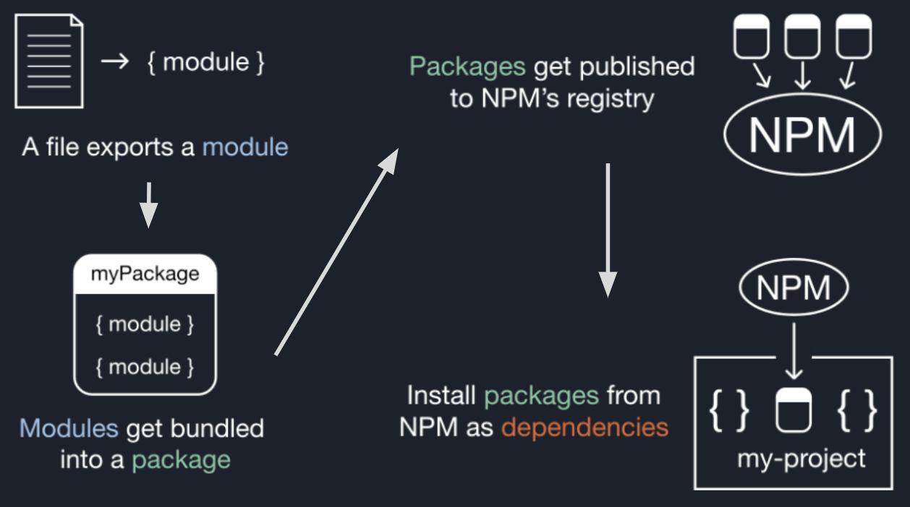

# Lesson 1.0.0 Intro to Node

### Resources 

* [Lecture Slides](https://docs.google.com/presentation/d/1FOZX8OwCfru2Qth1EvX7rRdzI9Hr1QDI3fo7QaR3yVI/edit#slide=id.g27e91089935_0_10) 
* [hey(node)](https://heynode.com/)
* [What Is package.json?(article)](https://heynode.com/tutorial/what-packagejson/)
* [What Is package.json?(video)](https://www.youtube.com/watch?v=YS3FDBjZCNc)
* [Create a package.json File (video)](https://youtu.be/RuFw4YlurnE?feature=shared)
* [Create a package.json File (tutorial)](https://heynode.com/tutorial/create-packagejson-file/?utm_source=youtube&utm_medium=referral+&utm_campaign=YT+description&utm_content=create-a-packagejson-file)
* [Module.exports and exports in Node.js](https://www.sitepoint.com/understanding-module-exports-exports-node-js/)
* 
### Lecture Objectives

* Understand what Node.js is and how we use it to run code on a server (any computer).
* Create modules and use named, and default exports to export data. 
* Load dependencies using the Node Package Manager(NPM).
* The various commands need when working on a Node.js project.
* Understand what a package.json is.
* Know the difference between npm package imports vs local modules
* What are npm scripts are and how to run them.

### Key Terms / Commands 

**Main Key Terms**

* Node.js
* Module
* Export
* Default Exports
* Name Exports
* Import
* Node Package Manager
* package.json

**Commands**
* `node`
* `npm init -y`
* `npm install <project-name>`
* `npm [name of script]`
* `npm run [name of script]`

**Code**
```js
//  default export
module.exports = value;
//  named exports
module.exports = {
  value1,
  value2,
};
//  import default export with require
const value = require('./file-path');
//  import named exports by using destructure with require
const { value1, value2 } = require('./file-path')
```
**Other terms**

* Browser
* Server
* Runtime Environment
* file extension
* front-end
* back-end

##  Where can we use JavaScript?

Short answer: A browser: Chrome, FireFox, Brave, Safari etc, or a server(any computer).

The original runtime environment that JavaScript ran on was the browser (RIP NETSCAPE). This helped enhance client-side scripting (websites on a browser), and added functionality to otherwise static website (built only using HTML and CSS.) This was the only option for scripting websites. 

In order to run code server-side (on the computer) at that time, you would use some other language. Since 2009 we have been able to run JavaScript using a server runtime called Node.js. Someone basically took the browser runtime environment and made so that you can just run it in your computer. This opened up the world for people to be full-stack developers without the need to learn a whole new server specific language.

### This Mod: Server. Next Mod: Browses.

Here at The Marcy Lab School, this first module will be taught and ran using Node.js. This is so we can learn the core of the language without having to worry about building and designing front-end websites. We'll do that in the next module!

We'll be able to use JavaScript in Node to create fun and sometimes useful scripts that we can run in the command line.

We'll also learn the value and importance of testing!


## Create your first script!

I know we have done this before, but here we are actually talking about what we are doing and demystifying it. For this lecture we don't have to worry about git so none of the commands will be need here (`git add` `git commit` etc...)

Make a dir called `first-script`
Inside, make a file called `index.js`
The `.js` is a “file extension”
Open up the file
Add some simple code like a log
Once you have made changes save you code (we are not staging or committing)

**Commands**
```bash
mkdir first-script 
touch first-script/index.js 
code first-script/index.js
```

**Code**
```js
console.log('Hello World');
```

## Running the file

You can run any JS file in the CLI. All you have to do is put `node` and then the file name. Any logs will output in the terminal. 

**Command**

```bash
node index.js
```

When you run this you can see that the program we wrote printed 'Hello World' in the terminal. This is a small program, this is not even a fraction of what we can accomplish with node. As we go on, you can see how much we can do!

## REPL

Node is a REPL environment. REPL stands for Read Evaluate Print Loop. It's an interactive programming environment where you can enter and execute code snippets one at a time (They remember variables created in the session). REPL environments allow developers to quickly test code snippets, algorithms, or ideas without creating full-fledged programs or scripts. In Node.js we accomplish this by the following:

Enter the command node without anything after it.
Type in your code and enter to move on.
add some more , and repeat as needed. 
Exit by doing Ctrl-C or type `.exit`

**Commands**
```bash
node

> let mom =  'norma'
undefined
> console.log(`my mother's name is ${mom}.`)
my mother's name is norma.
undefined
> 
(To exit, press Ctrl+C again or Ctrl+D or type .exit)
```

## What is a module?

In the context of Node.js, think of a module as a toolbox or a set of tools that helps you build your programs. Imagine you're building a model airplane. Instead of making every single piece from scratch, you have a kit with various pre-made parts like wings, propellers, and wheels. Each part has a specific function and fits together with others to create the complete model.

In Node.js, a module is like one of these pre-made parts. It's a collection of JavaScript functions and objects bundled together, designed to perform specific tasks or add specific features to your program.

Let break this down:

* A module is an exported chunk of code that can be used across our project. (This can be functions or values).
* Each file can export a module
* Modules help us organize our code


### Mechanics of a module

A module can export code from a file in 2 main ways: 

**Default Export**
Only one thing exported 

```js
//function that we want to export.
const bigDeal = () => {
  console.log("Such a big deal, I'm alone");
};

//using the module.exports object we assign the value we want to export
module.exports = bigDeal; 
```

**Named Export**
Many specific things exported

```js
//  First function we want to export
const add = (a, b) => {
  return a + b;
};
//  The second Function we want to export
const subtract = (a, b) => {
  return a - b;
};
//  Here is a value we wanty to export
const LAZY_PI = 3.14;
// Using the module.exports object we can assign it an object with the values we wanted exported.
module.exports = {
  add,
  subtract,
  LAZY_PI,
};
```
**Slide Note**

"constant naming convention" is used to make the code more readable and maintainable. When you export a constant variable, it's often written in all caps to indicate that it's a constant value and shouldn't be modified. this can be seen with `LAZY_PI`.

### OK, but why again?

Modules are a way for us to organize related code into separate files. Those files can then export their contents so that they can be used by our scripts. And there are two ways to make them. We will either have a single 


## Let's import them now!

So our modules export functions and values. We can use those functions and values by importing them using the require() function which takes in a relative file path and return the exports.

See the difference between the syntax for importing named exports vs default exports.

Once imported, we can just use those functions/values.

Here, we use console.log to test out the functionality and see they they are working. 

```js
const { add, subtract, LAZY_PI } = require('./named-exports');
const bigDeal = require('./default-export');

console.log('Hello World');

console.log(add(1, 2));
console.log(subtract(1, 2));
console.log('Lazy Pi Constant:', LAZY_PI);

bigDeal();
```

But what if you like a project so much you want to share it with the world? You can 'import' them into your own project using NPM.

## Node Package Manager (NPM)

A package is a collection of modules. You can share and use these packages by using NPM. When you install packages to your project, they’re called dependencies.



## `package.json` to manage our project

The package.json file stores information about a project:
The dependencies and their versions
Metadata for publishing our project
NPM Scripts
The package.json lives in the root of the directory, not a folder like `src/`

Let's do this together

**Commands**
```bash
mkdir my-test-project
cd my-test-project
touch index.js
npm init -y
npm install cowsay
```

**Code**
```js
const cowsay = require('cowsay');
console.log(cowsay.say({text: 'Hello World'}));
```

We have imported modules from a project called cowsay. to learn more about this project [click here](https://www.npmjs.com/package/cowsay).


When requiring modules in Node.js, you can either require local modules (modules that you have created in your project) or installed modules (modules that are available from the npm registry or other sources).

Local: Path Specification
```js
const { add, subtract, LAZY_PI } = require('./named-exports');
```
Installed: Package Name
```js
const cowsay = require('cowsay');
```

## Scripts

Scripts are for doing things like starting your project, or testing your code, scripts property in the package.json controls these.
You have “built ins” and custom scripts. 
You need the “run” keyword for non built in scripts.
For built ins: npm [name of script]
For custom: npm run [name of script]
```bash
npm test
npm run dev
``` 
ALWAYS do npm test on your HW!

