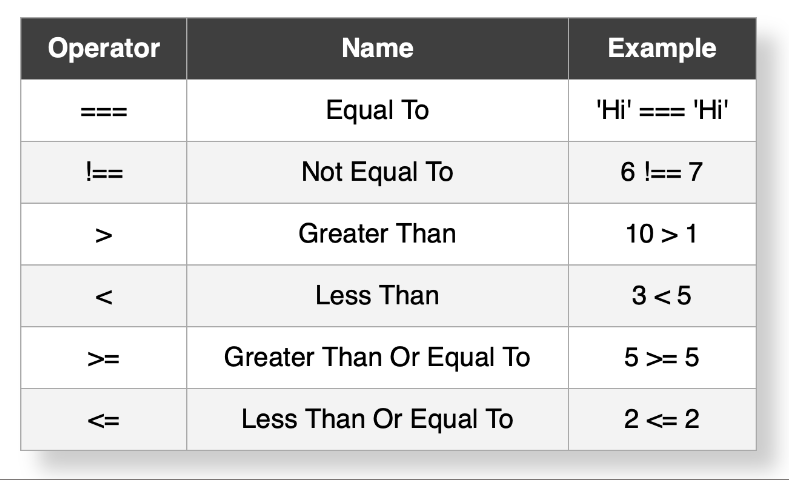

# Flow Control,Operators,and Math


### Resources
* [Slides](https://docs.google.com/presentation/d/102SIHvxRHHJ-_979yJdyq-3dI5NEVSME0uyBrSmgvrk/edit?usp=sharing)

### Lecture Objectives

- (CORE) How conditions work **REVIEW**
- (CORE) if/else statements **REVIEW**
- specific => general statements
- (CORE) Comparison and logical operators **REVIEW**
- (CORE) truthy/falsy values
- guard clauses
- ternarys
- (CORE) scope to lift up variables
- +,-,/,* **REVIEW**
- **, %
- .ceil(), .round(), .floor()
- (CORE) typeof operator
- typeof quirks: arrays, null, NaN

### Key Terms / Commands / Code

**Main terms**


**Code**

```js

```

**Other terms**


## Flow Control: If x, do y

Programs usually change their behavior based on inputs

Conditions and booleans 
If something is `true` or `false`

`if/else`, `switch` or `ternarys`
Decide what to do in a given situation


### Conditions and Comparisons

Conditions evaluate to `true` or `false` 
They do this with Comparison Operators and Logical Operators
Comparison operators compare 2 values of the same type
Logical operators compare the outcomes of 2 conditions.


