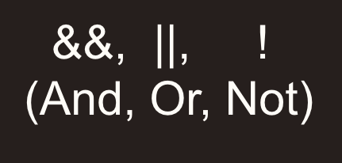

# Flow Control,Operators,and Math


### Resources
* [Slides](https://docs.google.com/presentation/d/102SIHvxRHHJ-_979yJdyq-3dI5NEVSME0uyBrSmgvrk/edit?usp=sharing)

### Lecture Objectives

- (CORE) How conditions work **REVIEW**
- (CORE) if/else statements **REVIEW**
- specific => general statements
- (CORE) Comparison and logical operators **REVIEW**
- (CORE) truthy/falsy values
- guard clauses
- ternarys
- (CORE) scope to lift up variables
- +,-,/,* **REVIEW**
- **, %
- .ceil(), .round(), .floor()
- (CORE) typeof operator
- typeof quirks: arrays, null, NaN

### Key Terms / Commands / Code

**Main terms**


**Code**

```js
//  if
if () {

}
//  if /else
if (condition) {
  //  code
} else {
  //  code
}
//  if / else if
if (specificCondition) {
  //  code
} else if (broaderCondition) {
  //  code
} else {
  //  code
}

// Comparison Operators
=== //  Equal to
!== //  Not Equal to
> //  Greater Than
< // Less Than
>= // Greater Than or Equal To
<= // Less Than or Equal To

//  Logic Operators

&& // and
|| // or
! //  not

// typeOf operator
typeOf();

// new methods
Math.floor();
Math.round();
Math.ceil();
Math.random();

```

**Other terms**


## Flow Control: If x, do y

Programs usually change their behavior based on inputs

Conditions and booleans 
If something is `true` or `false`

`if/else`, `switch` or `ternarys`
Decide what to do in a given situation


### Conditions and Comparisons

Conditions evaluate to `true` or `false` 
They do this with Comparison Operators and Logical Operators
Comparison operators compare 2 values of the same type
Logical operators compare the outcomes of 2 conditions.




### `if/else` statements

3 parts: `if`, `else if`, `else`
Starts checking at the top, stops checking when hits a match
Only 1 block ever actually executed
Start specific, get more general
Not all of 3 parts required for each statement


```js
const happyBirthday = (age) => {
  if (age === 25) {
    console.log('Happy birthday, you can rent a car!');
  } else if (age < 25) {
    console.log('No rental cars on your b-day yet.');
  } else if (age < 90) {
    console.log('Enjoy car rentals on your b-day!');
  } else {
    console.log('You should probably not be driving.');
  }
};

happyBirthday(25);
happyBirthday(20);
happyBirthday(30);
happyBirthday(90);

const election = (age, isElectionDay, isUndecided) => {
  if (age < 21 || !isElectionDay) {
    console.log("Can't vote today!");
  } else if (age >= 21 && isUndecided) {
    console.log("Here's some voter info young one");
  } else if (age >= 50 && !isUndecided) {
    console.log('Ok Boomer, you seem sure, but please think of future generations');
  } else {
    console.log('Thank you for your vote.');
  }
};
```


```js
const election = (age, isElectionDay, isUndecided) => {
  if (age < 21 || !isElectionDay) {
    console.log("Can't vote today!");
  } else if (age >= 21 && isUndecided) {
    console.log("Here's some voter info young one");
  } else if (age >= 50 && !isUndecided) {
    console.log('Ok Boomer, you seem sure, but please think of future generations');
  } else {
    console.log('Thank you for your vote.');
  }
};
```
## Coercions and Truthiness

JS will coerce types into other types
for example `1 + ‘1’ === ‘11’`
coercion is why we use === and not ==
-	=== does not coerce, diff types just fail
A type of coercion we do use is truthy/falsy
That’s where types get forced into booleans


```js
const checkTruthy = (val) => {
  if (val) {
    console.log('Truthy!', val);
  } else {
    console.log('Falsy!', val);
  }
};

checkTruthy(0);
checkTruthy(1);
checkTruthy(-1);
checkTruthy(NaN);
checkTruthy('');
checkTruthy('hi');
checkTruthy(null);
checkTruthy(undefined);
checkTruthy([]);
checkTruthy({});

// can also use !! to check truthiness
console.log(!!0); // false;
console.log(!!1); // true;
```

## Simplify your LOGIC

**Don't nest too much**
Code should be readable
Avoid deeply nested `if/else` stmnts
Avoid unnecessary `if/else` stmnts
Use guard clauses
Use ternary's 
Return booleans directly

```js
// refactor with guard clause
const doAdminThingsBetter = (role) => {
  if (role !== 'admin') return console.log('Nothing to do');
  console.log('You can do admin things');
  console.log('You can do more admin things');
  console.log('You can do even more admin things');
};

// If time, do advanced refactor with guard clause
const getMedicalCostBetter = (hasInsurance, surgeryLevel) => {
  if (!hasInsurance) return 100000;
  if (surgeryLevel === 'major') return 500;
  if (surgeryLevel === 'minor') return 300;
  return 100;
};

// Refactor with ternary
const getCoolness = (likesPets) => {
  return likesPets ? 'cool' : 'not cool';
};
```


### Scope and variables

If you want to get variables out of blocks,
you have to define the variable in a higher scope
Remember, values in a higher scope are visible to lower scopes

```js
const getBioBest = (age, first, last) => {
  let dynamicBio = `Wow, ${first} ${last} is already ${age} years old. Getting up there!`;
  if (age < 18) {
    dynamicBio = `${first} ${last} is only ${age} years old. Still a child!`;
  } else if (age < 50) {
    dynamicBio = `${first} ${last} is ${age} years old. Still young at heart!`;
  }
  console.log(dynamicBio);
  const finalBio = `Here's their bio: ${dynamicBio}. Click the profile for more info.`;
  console.log(finalBio);
};
```

## TypeOf

**Check types with typeOf**
`typeof` is not a function it’s an operator
Since it only takes one “operand” it’s a “unary operator”
Pretty straightforward except for: 
`null === object` bug
`Number.isNaN()`
`Array.isArray()`

```js
// // Use typeof to tell what type a variable is
console.log(typeof 'hi'); // string
console.log(typeof 4); // number
console.log(typeof true); // boolean
console.log(typeof undefined); // undefined
console.log(typeof null); // object
console.log(typeof { ok: true }); // object
console.log(typeof [1, 2, 3]); // object
console.log(typeof NaN); // number
console.log(typeof (() => {})); // function

// check NaN with isNaN
console.log(Number.isNaN(NaN)); // true
console.log(Number.isNaN(1)); // false
console.log(Number.isNaN('1')); // false

const nullVariable = null;
// check null with ===
console.log(nullVariable === null); // true
console.log(nullVariable === undefined); // false

// check arrays with Array.isArray
console.log(Array.isArray([1, 2, 3])); // true
console.log(Array.isArray({ ok: true })); // false
```

## Math Operations

+, -, /, *
`x ** y` means rais x to the y power
`%` is a modulo, remainder division
5/2 = 2.5, but 5 % 2 = 1 (the remainder)

`Math.floor()`, `Math.round()`, `Math.ceil()`
`Math.random()`

```js
console.log(Math.round(2.5)); // 3
console.log(Math.floor(2.99)); // 2
console.log(Math.ceil(2.01)); // 3

console.log(2 ** 3); // 8

const getRandomInt = (max) => Math.floor(Math.random() * max);

console.log(getRandomInt(3)); // 0, 1 or 2

console.log(getRandomInt(1)); // always 0

console.log(Math.random()); // float 0 to <1
```