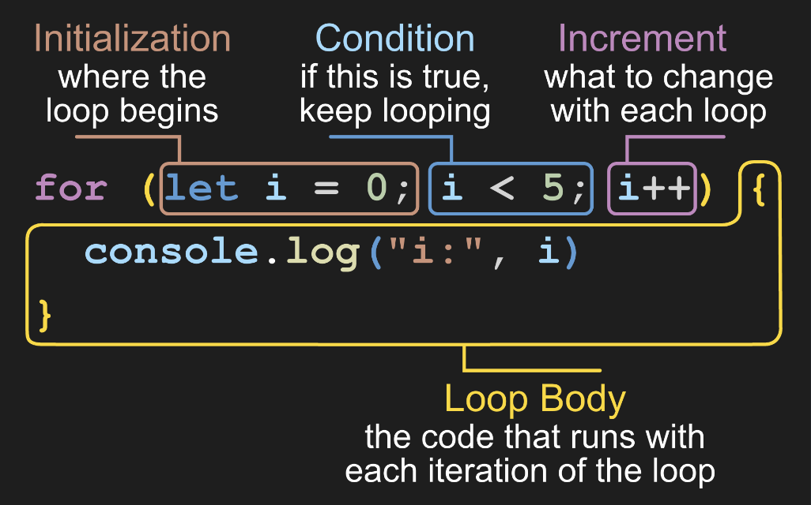

# Loops

### Resources
* [Slides](https://docs.google.com/presentation/d/1enxsqCt0OykPNWNBW1zsGY6MMruJVogAAuwhB75ZsuQ/edit?usp=sharing)

### Lecture Objectives

# Skills we're teaching
- (CORE) `for` loop **review**
- (CORE) initialization, condition, incrementor	**review**
- (CORE) string iteration
- `continue`
- `break`
- (CORE) `return`
- (CORE) `while` loop
- `while` loop unknown length
- know existence of `do while` loop
- nested loops

## Expected Existing skills
- Roughly familiar with basic for loop construction
- Know strings are 0 indexed

### Key Terms / Commands / Code

**Main terms**


**Code**


```js
continue
break
```