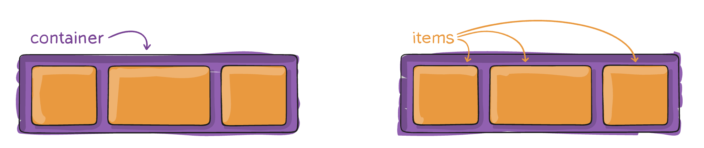
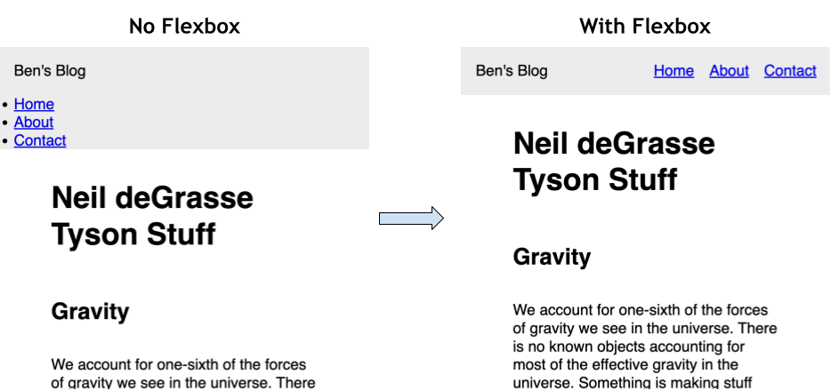
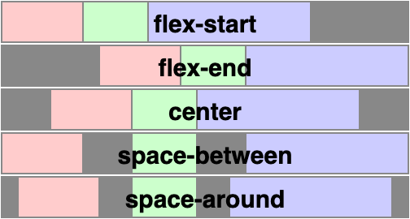
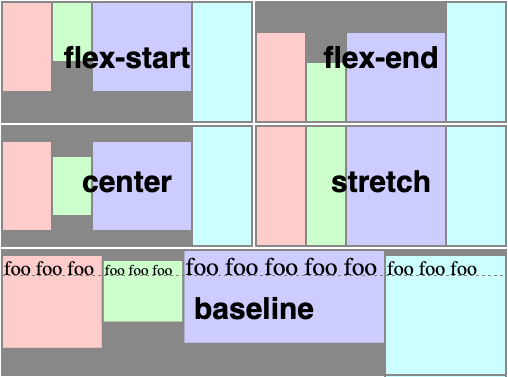
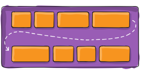

# 2.1.0 Flexbox Lecture Plan

**Resources**:
* [A guide to flexbox](https://css-tricks.com/snippets/css/a-guide-to-flexbox/)
* [A great video to learn flexbox](https://www.youtube.com/watch?v=u044iM9xsWU&ab_channel=KevinPowell)

**Table of Contents**:
- [Part 0 - Explore Flexbox on Youtube](#part-0---explore-flexbox-on-youtube)
- [Part 1 - Flex Containers and Flex Items](#part-1---flex-containers-and-flex-items)
- [Part 2 - Demo Styling a Navbar using Flexbox Container Properties](#part-2---demo-styling-a-navbar-using-flexbox-container-properties)
- [Part 3 - Flexbox Main and Cross Axes](#part-3---flexbox-main-and-cross-axes)
  - [Justify Content](#justify-content)
  - [Align Items](#align-items)
  - [Flex Direction](#flex-direction)
- [Part 4 - Growing and Shrinking](#part-4---growing-and-shrinking)
  - [Flex Wrap](#flex-wrap)
  - [Flex Grow](#flex-grow)
  - [Equal Columns](#equal-columns)

## Part 0 - Explore Flexbox on Youtube

https://www.youtube.com/ 

Flex does two things: 
1. puts things in a row (or column if you need to)
2. makes things stretchy
3. control the relative size of elements in a row


## Part 1 - Flex Containers and Flex Items

* Flexbox is used for **organizing elements in a single direction**
* `display: flex` defines a **flex container**. 
* The children of the flex container are **flex items**
* By default, flex items are placed in a row



## Part 2 - Demo Styling a Navbar using Flexbox Container Properties

* Ordinarily, elements are `display: block` elements are stacked on top of each other.
* `display: flex` arranges flex items horizontal
* Making a navigation bar is one of the common applications of flexbox since **we typically want to align navigation elements horizontally**.



```css
header {
  display: flex; /* Makes the header a flex container */
  justify-content: space-between; /* main-axis spacing */
  align-items: center; /* cross-axis spacing */
}

ul {
  display: flex;
  gap: 1rem; /* increasing spacing between flex items */
}
```

* The essential **flex container properties** are:
  * `justify-content` — defines alignment along the **main axis**
  * `align-items` — defines alignment along the **cross axis**
  * `gap` — controls spacing _between_ flex items (not on outer edges)
  * `flex-direction` - defaults to `row` but can be set to `column` to arrange flex items vertically.


## Part 3 - Flexbox Main and Cross Axes

> **Pacing:** 10 minutes (35 minutes total)
> **Learning Objective:** Understand that flexbox containers have two axes: main and cross
> * Now that we've seen what flexbox can do, we can dive deeper into how flexbox works. Explore how direction changes the axes and how justify-content and align-items work.

* Flexbox has two axes, the **main axis** and the **cross axis**


### Justify Content

* `justify-content` affects the positioning of flex items along the **main axis**



### Align Items

* `align-items` affects the positioning of flex items along the **cross axis**



### Flex Direction

* `flex-direction: column` changes the orientation of the main and cross axes. 
  * The main axis is now vertical
  * The cross axis is now horizontal

## Part 4 - Growing and Shrinking

> **Pacing:** 15 minutes (50 minutes total)
> **Learning Objective:** See how flex items behave when space is limited.
> * Now open the `2-flexing/` directory and serve the `index.html` page.
> * Here we want to demonstrate how the `flex-wrap`, `flex-basis` and `flex-grow` properties all control how flex items behave when space is limited. Show first what the default behavior of flex items is without any of these values set. Then add/remove them to show the difference. 
> `flex-basis` often causes confusion since it is similar (but different) from setting the `width` of each flex item.

### Flex Wrap

* By default, flex items will all try to fit onto one line.



```css
.container {
  flex-wrap: nowrap | wrap | wrap-reverse;
}
```

### Flex Grow

* `flex-grow` defines the ability for a flex item to grow if necessary. 


* It accepts a unitless value that serves as a proportion. 
* It dictates what amount of the available space inside the flex container the item should take up.

```css
.flex-item { flex-grow: 1 }
.flex-item:nth-child(2) { 
  flex-grow: 2
}
```

* If all items have flex-grow set to 1, the remaining space in the container will be distributed equally to all children. 
* If one of the children has a value of 2, that child would take up twice as much of the space either one of the others (or it will try, at least).

### Equal Columns

* To achieve equal columns, we need to ensure that each flex item starts with the same size (`flex-basis: 0%`) and will grow/shrink at the same rate (`flex-grow: 1` and `flex-shrink: 1`).

```css
.flex-item {
  flex-grow: 1;
  flex-shrink: 1;
  flex-basis: 0;
  /* flex: 1 1 0; */
  /* flex: 1; */
}
```

* The `flex` property can serve as a short-hand for all three: `flex: 1 1 0%`
* The default is `0 1 auto`, but if you set it with a single number value, like `flex: 5;`, that changes the `flex-basis` to `0%`, so it’s like setting `flex-grow: 5; flex-shrink: 1; flex-basis: 0%;`.

## Part 5 - Examples!

* Check out the `3-photo-gallery/` directory for a cool example of using flexbox to make a wall-to-wall flexible photo gallery based on this post: [Adaptive Photo Layout With Flexbox](https://css-tricks.com/adaptive-photo-layout-with-flexbox/)
* [19 CSS Flexbox Examples](https://freefrontend.com/css-flexbox-examples/)