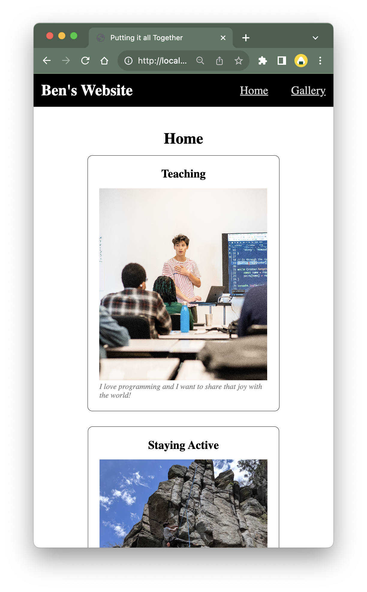
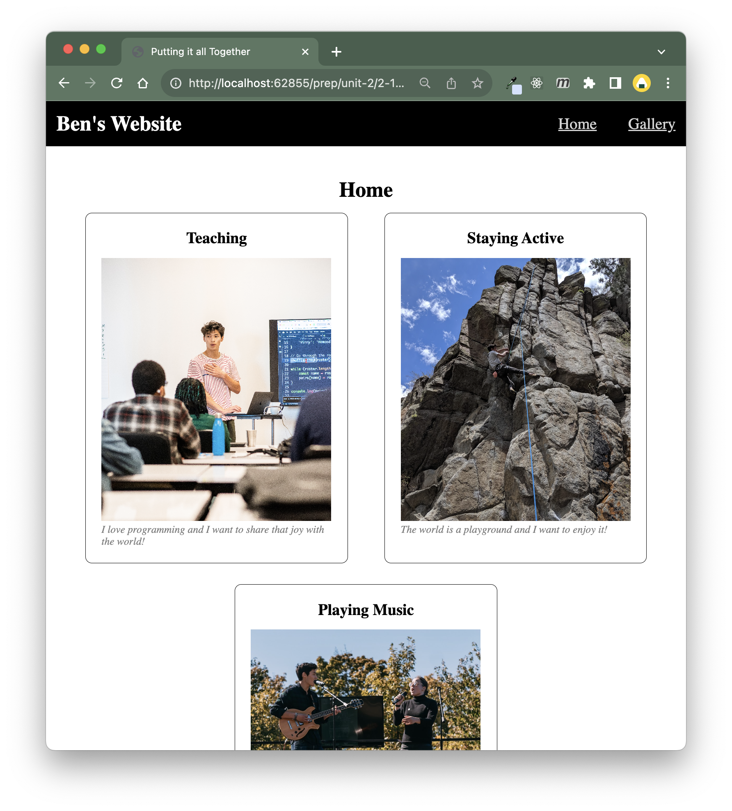
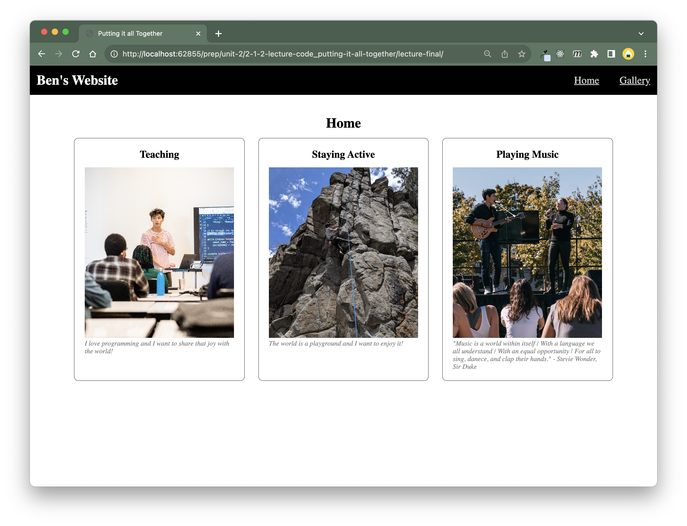

# Putting It All Together

## Requirements

* Build a 2-page app (home and gallery)
* Shared styles for general themes
* Shared styles for navbar
* Homepage has
  * Navbar styled with flexbox
  * main with 3 cards
    * In mobile view they are stacked
    * In desktop view they are in a row
* Gallery has:
  * Navbar styled with flexbox
  * main with a gallery
    * 3 columns in desktop view
    * 2 columns in tablet view
    * 1 column in mobile view

## Mockups

### Home page in mobile view:

### Home page in tablet view:

### Home page in desktop view:

### Grid in desktop view:

