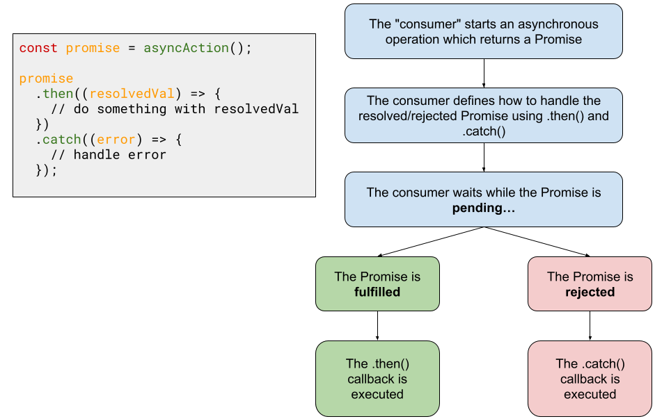

# Promises

Clone this repo down [here](https://github.com/The-Marcy-Lab-School/3-0-0-intro-to-promises-f23)

**Table of Contents**

- [Sync vs. Async](#sync-vs-async)
- [So… what next? Callbacks](#so-what-next-callbacks)
  - [Limitations of Callbacks — Callback Hell](#limitations-of-callbacks--callback-hell)
- [So… what next? Promises!](#so-what-next-promises)
- [Promise Syntax: Resolve and Then](#promise-syntax-resolve-and-then)
- [Promise Syntax: Reject and Catch](#promise-syntax-reject-and-catch)
- [Best Practice: Reject with an Error](#best-practice-reject-with-an-error)
- [Chaining Promises](#chaining-promises)

## Sync vs. Async

**Synchronous operations** MUST be completed before the program can do anything else. Most code we write is synchronous (and that’s okay because most things take *very* little time to complete).

```jsx
console.log(1);
console.log(2);
console.log(3);
```

An **asynchronous operation** is anything that takes time to complete.

> Imagine walking into a Pizza shop and you ask for a slice of cheese pizza. The pizza isn’t ready yet so you have to wait. The person at the register gives you a **ticket** to claim your slice when it is ready. Meanwhile, you are free to run other errands and can return later to pick up your pizza. You get notified that the pizza is done so you return to the shop, hand in your ticket, and take your pizza home.
> 

This is the essence of **asynchronous operations.** 

- Some operation is going to take some time to complete
- In the meantime, you can do other things.
- When the operation is complete, we can do something in response.

## So… what next? Callbacks

When working with asynchronous code, since we aren’t always aware of ****when**** the operation will complete, **we need to provide instructions for what to do when that time comes.**

We’ve done this with event handlers using a callback: *when a button is clicked, handle it with this callback...*

```jsx
document.querySelector('#clickButton').addEventListener('click', (e) => {
	console.log('the button has been clicked!'));
}
```

With `setTimeout` we also do this with a callback. `setTimeout` is a good way to fake asynchronous operations. `setTimeout` takes a callback and an amount of time in milliseconds (1000ms === 1s). It will execute the callback after the time passes.

```jsx
console.log('starting!');
setTimeout(() => { // wait 3 seconds then...
	console.log(1)
}, 3000)

setTimeout(() => { // wait 1 seconds then...
	console.log(2)
}, 1000)

setTimeout(() => { // wait 2 seconds then...
	console.log(3)
}, 2000)
console.log('done!');
```

- Synchronous operations will complete first, then asynchronous operations, no matter how long the async operation takes.

**<details><summary>Q: In what order will the console log statements be executed? What happens if we set the timers to `0`?</summary>**

```
"starting!"
"done!"
2
3
1
```

and then `1` `2` `3` if the timers are set to `0`, but `"starting!"` and `"done!"` will still be first. This is because synchronous operations will complete first, no matter how quickly the asynchronous operations take.

</details><br>

### Limitations of Callbacks — Callback Hell

In the previous example, we essentially start all of the timers at the same time. We aren't waiting for one to finish to start the next. But what if we wanted to?

```jsx
console.log('starting!');
setTimeout(() => { // wait 3 seconds then...
	console.log(1)
	setTimeout(() => { // wait 1 seconds then...
		console.log(2)
		setTimeout(() => { // wait 2 second then...
			console.log(3)
			console.log('done!');
		}, 2000)
	}, 1000)
}, 3000)
```

The basic idea behind this approach is:

- Start an asynchronous process
  - When the operation is complete, do something next…
    - When that operation is complete, do something next…
      - When that operation is complete, do something next…

This approach is commonly referred to as **callback hell**. 

Promises aim to provide a more readable approach.

## So… what next? Promises!

**Promises are used when we want to get some data, but we know it will take time.** More specifically, **a promise is an object** that represents the eventual completion of an asynchronous operation and the resulting value.

**<details><summary>Q: In this pizza example, what is the promise? what is the resulting value?</summary>**

The ticket is the promise. The resulting value is the pizza!

</details><br>
  
**<details><summary>Q: What are more code-related examples of asynchronous operations?</summary>**

- Event handlers! (when I click on this button, show me something)
- a request to get data from a server (show me the posts on my Instagram feed)
- a request to send data to a server (post a new picture on my Instagram account)

</details><br>

Promise objects also use callbacks to do something when the async operation is complete, however it is slightly different.

```jsx
const promise = asyncAction();

promise
	.then((resolvedValue) => {
		// do something with resolved value
	})
	.catch((error) => {
		// handle error
	});
```

Using a Promise involves two steps:

1. Start the asynchronous operation and get a Promise back
2. Define how to handle the resolved/rejected Promise using `.then()` and `.catch()`
    

    
As the asynchronous operation is carried out, the Promise will exist in one of three states: 

- **pending** - the operation is still working and the promise is not yet “settled”
- **fulfilled** - the operation was a success! We got the value we wanted. Commonly referred to as “resolved”
- **rejected** - the operation failed. We got an error back.

## Promise Syntax: Resolve and Then

When making a Promise, we define when/how it will resolve. 

Then, the “consumer” of the Promise defines what to do with the resulting value.

```jsx
// This function makes a promise and returns it.
const asyncAction = () => {
	console.log('async action started');

	const promise = new Promise((resolve, reject) => {
		setTimeout(() => {
			console.log('async action done!');
			resolve("Success!"); // resolve after 500ms
		}, 500);
	});

	return promise;
}

// "consume" the promise
const myFirstPromise = asyncAction();

// schedule a callback to execute when the promise resolves
myFirstPromise.then((successMessage) => {
	console.log(`Fulfilled! ${successMessage}`);
});

console.log("when does this happen?");
```

- When making a Promise, we call `resolve(...)` when what we were doing asynchronously was successful and `reject(...)` when it failed.
  - In this example, we use `setTimeout(...)` to simulate async code whereas a more realistic example might make an HTTP request or interact with a database.
- Most often, you don’t create Promises yourself. You’ll use functions like `fetch` that return a Promise and you’ll just need to know how to use the returned Promise (using `.then`), but it’s good to know how a Promise is made.

**<details><summary>Q: When does that final `console.log("when does this happen")` get printed? Before or after the `.then()`? What happens if we set the timeout delay to `0`.</summary>**
  
Synchronous code will **always** be executed before asynchronous code

</details><br>
    

## Promise Syntax: Reject and Catch

In the last example, the Promise only ever resolves. But most promises will either resolve or reject. 

In this example, the Promise will randomly resolve or reject.

The “consumer” of the Promise then handles each case accordingly.

```jsx

const asyncAction = () => new Promise((resolve, reject) => {
	setTimeout(() => {
		const random = Math.random();
		if (random > 0.5) {
			resolve(random); // this value will be passed to the .then() callback
		} else {
			reject(random); // this value will be passed to the .catch() callback
		}
	}, 500);
}); 

myFirstPromise = asyncAction();

myFirstPromise
	.then((data) => { // executes if `resolve()` was invoked
		console.log(`Fulfilled! ${data}`)
	})
  .catch((errorMessage) => { // executes if `reject()` was invoked
		console.error(`Rejected :( ${errorMessage}`)
	})
```

## Best Practice: Reject with an Error

In the last example, we invoke `resolve` and `reject` with the same value. However, as a best practice, we should `reject` with an `Error` object. Most producers of Promises adhere to this best practice and most consumers of Promises expect this. 

```jsx
const asyncAction = () => new Promise((resolve, reject) => {
	setTimeout(() => {
		const random = Math.random();
		if (random > 0.5) {
			resolve(random);
		} else {
			reject(new Error(random)); // Create an Error object with random as the "message"
		}
	}, 500);
}); 

myFirstPromise = asyncAction();

myFirstPromise
	.then((data) => {
		console.log(`Fulfilled! ${data}`)
	})
	.catch((error) => { // error is the rejected Error object which has a .message property
		console.error(`Rejected :( ${error.message}`)
	})
```

## Chaining Promises

Now **this** is where Promises are super useful and solve the callback hell approach. 

`.then()` (and `.catch()`) will always return a Promise that you can chain additional `.then()` calls to. 

The Promise that `.then()` returns will resolve to the value that its callback returns.

```jsx
// Promise.resolve("a") is shorthand for: new Promise((resolve) => resolve("a"))

Promise.resolve("a") // The first promise resolves with "a"
  .then((str) => { 
		console.log(str) // print "a"
		return "b";      // This `.then()` resolves a new promise with "b"
	})
	.then((str) => { 
		console.log(str) // print "b"
		return "c";      // This `.then()` resolves a new promise with "c"
	})
	.then((str) => {
		console.log(str) // print "c"
		// This `.then()` just resolves a new promise with undefined
	})
	.then(console.log) // print "undefined"
```

Next time, we’ll write code like this:

```jsx
// Execute async code that returns a Promise
const fetchPromise = fetch('https://pokeapi.co/api/v2/pokemon/pikachu');

// Define what to do with the resolved Promise
fetchPromise
	.then((response) => response.json())
	.then((jsonData) => console.log(jsonData))
	.catch((error) => console.error(error.message))
```
