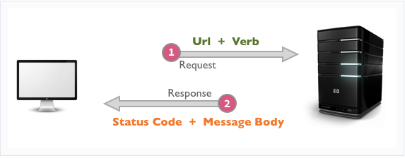

# Fetch

## Cross-Application Communication (20 min)

Okay now we’re really getting somewhere. So far we’ve been writing programs that consist ENTIRELY of code that we write (or download via npm). Now, we will enter the world of 


A web application's most common asynchronous operation is requesting data from another computer. For example:

- I want my web application to show the current weather. I can request that data from a Weather API.
- I want my web application to show a Google map. I can request that map from the Google Maps API
- I want my web application to find random pictures of dogs on the internet. I can request those images from the [dog api](https://dog.ceo/dog-api/)


## HTTP Request / Response Cycle (20 min)

HTTP stands for **H**yper********t********ext **T**ransfer **P**rotocol. It is the standard for communication over the internet. (Well HTTPS, the “secure” version, is now the standard).



The HTTP Request/Response cycle is the pattern of communication used by two computers communicating using the HTTP protocol. It works like this:

* The program/computer making the request is the **client**
* That program/computer responding to the request is called the **server**
* The request and response sent between the client and server each contain important information including:
  * The **request URL** of the specific requested resource
  * The **request verb** — what it wants the server to do (post something new, send back some data, update or delete something)
  * The **response status code** (did the request succeed?)
  * The **response body** (the data sent back to the client)

In order for this to work

- The server must already be up and running and ready to accept incoming requests.
- The client must initiate a request. A server can’t reach out and send Responses  to clients on its own. It just waits for incoming requests.

## The `fetch()` function

`fetch()` is a browser-native function that sends a request to a server. (it's coming to Node soon too!)

At minimum, it takes in a URL of the API whose data we want to access and returns a `Promise`. For the vast majority of the time, it will look like this:

```jsx
const fetchPromise = fetch('https://pokeapi.co/api/v2/pokemon/pikachu');

fetchPromise
	.then((response) => response.json())
	.then((jsonData) => doSomethingWith(jsonData))
	.catch((error) => console.error(error.message))
```

- `fetch` takes in a URL of a resource that we want to request. Here we are using the API https://pokeapi.co/ and the specific “endpoint” https://pokeapi.co/api/v2/pokemon/pikachu
- Try these other API endpoints:
  - https://dog.ceo/api/breeds/image/random
  - https://api.sunrise-sunset.org/json?lat=36.7201600&lng=-4.4203400&date=2023-3-15
  - https://v2.jokeapi.dev/joke/Programming
- `fetch` returns a promise that will resolve to a [Response object](https://developer.mozilla.org/en-US/docs/Web/API/Response) which contains information about the HTTP response (more on that next).
- The `response` object has a `.json()` method which parses the body of the response as JSON. This is also asynchronous and returns another promise.
- Once the data is parsed, we can then use it (print it, render it, etc…)
- We catch any errors that may occur (it will be an `Error` object so in this example, we print out the `.message`)

```jsx
const fetchPromise = fetch('https://pokeapi.co/api/v2/pokemon/pikachu');

fetchPromise.then((response) => {
	console.log(response.url)	
	console.log(response.ok)
	console.log(response.status)
	console.log(response)
});
```

### HTTP Status Codes

Every Response that we receive from a server will include a status code indicating how the request was processed. Was the resource found and returned? Was the resource not found? What there an error? Did the POST request successfully create a new resource? 

Responses are grouped in five classes:

- Informational responses (100 – 199)
- Successful responses (200 – 299)
- Redirection messages (300 – 399)
- Client error responses (400 – 499)
- Server error responses (500 – 599)

Important ones to know are 200, 201, 204, 404, and 500

### URLs

Every URL has a few parts. Understanding those parts can help us fetch precisely the data we want.

Consider this URL which tells us information about the sunrise and sunset at a particular [latitude and longitude](https://en.wikipedia.org/wiki/Geographic_coordinate_system#Latitude_and_longitude):

```
https://api.sunrise-sunset.org/json?lat=36.7201600&lng=-4.4203400&date=2023-3-15
```

Let's break it down:

- `https://api.sunrise-sunset.org` — This is the **host**. It tells the client where the resource is hosted/located.
- `/json` - This is the **path**. It shows what resource is being requested
- `?lat=36.7201600&lng=-4.4203400&date=2023-3-15` - These are **query parameters** and this particular URL has 3: `lat`, `lng`, and `date`. Query parameters begin with a `?` are are separated with `&`. Each parameter uses the format `name=value`. Try changing the `date` parameter!

When using a new API, make sure to look at that APIs [documentation](https://api.sunrise-sunset.org/) (often found at the host address) to understand how to format the request URL.

## Kinds of Requests - HTTP Verbs

HTTP requests can be made for a variety of purposes. Consider these examples related to Instagram:

- The client requests to see all posts made by Beyonce (Read)
- The client requests to post a new picture on their profile (Create)
- The client requests to update a post they made yesterday (Update)
- The client requests to delete a post they made yesterday (Delete)

Each of these actions has an HTTP verb that is associated with it.

- `GET` - Read
- `POST` - Create
- `PATCH` - Update
- `DELETE` - Delete

This HTTP verb or “method” is sent in the HTTP Request so that the server knows what kind of request it is receiving.

The default behavior of using `fetch` is to make a `GET` request, but we can also make other kinds of requests by adding a second `options` argument to `fetch()`:

```jsx
const options = {
    method: "POST",
    headers: {
      "Content-Type": "application/json",
    },
    body: JSON.stringify(myData)
  }
fetch(url, options)
  .then(response => response.json())
  .catch(console.error)
```

Most of this is also boilerplate (its mostly the same each time). The `method` determines the kind of request, the `headers` determines the type of data we are sending to the server (JSON), and the `body` determines *****what***** we send to the server. Note that it must be stringified first.  