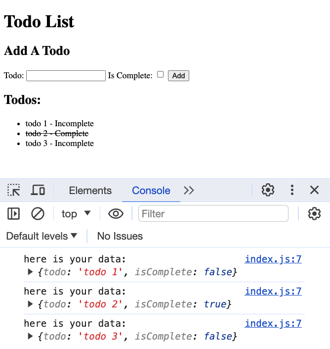

# Unit 2 - DOM Manipulation

**Table of Contents:**
- [Forms](#forms)
- [Event Listeners / Event Handlers](#event-listeners--event-handlers)
- [DOM CRUD Basics](#dom-crud-basics)
- [Todo App Challenge](#todo-app-challenge)

## Forms

Forms are used for a variety of things. For example:
* getting user login information
* a search bar
* etc...

Forms have a very specific structure:

```html
<form id="pokemon-search-form" aria-labelledby="pokemon-search-header">
  <h2 id="pokemon-search-header">Find a Pokemon</h2>
  <label for="pokemon">Pokemon Name:</label>
  <input type="text" name="pokemon" id="pokemon-input" />
  <button type="submit">Submit</button>
</form>
```

Every form should have:
* An `id` for easy DOM targeting
* An `aria-labelled-by` for screen readers referencing the `id` of the `h2` (if there isn't a visible `h2`, use `aria-label`) 
* An `h2`, also for screen readers
* `label` and `input` elements. 
  * For every `input`, you must have an `label`
  * The `id` of the input should match the `for` of the `label`
* A `button` for submitting the form

**<details><summary style="color: purple">Q: What is the difference between the `id` and the `name` of an `input` element?</summary>**

> The `id` is used to connect an `input` to its `label`. The `name` of the input is used when we collect data from the form. If we have an `input` with the `name="email"`, we can access the value like so:
>
> ```js
> const form = document.querySelector('form');
> const emailValue = form.email.value;
> // or
> const formObj = Object.fromEntries(new FormData(form));
> const emailValue = formObj.email;
> ```

</details><br>

## Event Listeners / Event Handlers

Adding an event listener to an element allows us to define a callback to execute when an event occurs. This example increments a `count` each time a button is clicked.

```js
let count = 0;
const button = document.querySelector('#counter-button');
button.textContent = 0;

button.addEventListener('click', (e) => {
  // invoked when the button is clicked
  count++;
  button.textContent = count;
});
```

Forms need to respond to `'submit'` events. Form event handlers typically look like this:

```js
const form = document.querySelector('#pokemon-form');
form.addEventListener('submit', (e) => {
  // stop the reload/redirect
  e.preventDefault();

  // the FormData API makes it SUPER easy to get an object with all form data with 2 steps:
  const formData = new FormData(e.target);
  const formObj = Object.fromEntries(formData);

  // Checkbox data in the formObj will either be "on" or undefined
  // We can convert those values to true/false
  formObj.checkedProperty = !!formObj.checkedProperty

  console.log('here is your data:', formObj);

  // do something with the form

  e.target.reset(); // reset the form
});
```

The callback provided to `addEventListener` is invoked with an `Event` object, typically referenced by a parameter called `e` or `event`. That object has information about the event such as the `.target` of the event which is used here to get the form data.

**<details><summary style="color: purple">Q: Why do we use `e.preventDefault()` when handling a form submission?</summary>**

> The default behavior of a form submission is to refresh the page. The form inputs are also added to the URL as query parameters. Instead, we want to keep the user on the page without reloading so we can handle the form submission with JavaScript.

</details><br>

## DOM CRUD Basics

Using the DOM API, we can perform basic CRUD operations:
* Create new elements and insert them into the DOM
* Get (Read) an existing element in the DOM
* Update the properties of existing elements in the DOM
* Delete existing elements from the DOM

```js
// Get elements from the DOM using document.querySelector
const someElement = document.querySelector("#some-element-id");
const someList = document.querySelector("ul");
const bodyElement = document.body;

// Create new elements and insert them into the DOM
const someDiv = document.createElement('div');
const img = document.createElement('img')
body.append(someDiv);
someDiv.append(img);

const listItem = document.createElement('li');
someList.append(listItem);

// Update the properties of elements
someList.innerHTML = '';                // clear out the children of the list
listItem.textContent = 'hello world';   // change the inner text content
listItem.classList.add('bolded');       // add a clas
listItem.classList.remove('italic');    // remove a class
listItem.classList.toggle('visible');   // toggle on/off a class
listItem.id = 'first element';          // set an id
img.src = 'somepicture.png';            // set a picture src attribute

// Remove elements from the DOM
someDiv.remove();
```

**<details><summary style="color: purple">Q: When is it appropriate to use `.innerHTML` to change the contents of an element?</summary>**

> We can use `.innerHTML` if we are in full control of how we are changing the `.innerHTML`. For example, we can use it to clear out the contents of an element, or to insert child elements with a known structure. 
> We should NEVER use `.innerHTML` to insert HTML elements that are in any way generated dynamically by the user unless we first "sanitize" the user data of malicious code. This is called "escaping".

</details><br>

## Data Attributes

The syntax is simple. Any attribute on any element whose attribute name starts with `data-` is a data attribute. 

Say you have an article and you want to store some extra information that doesn't have any visual representation. Just use `data` attributes for that:

```html
<section id="cars">
  <article
    id="electric-cars"
    data-columns="3"
    data-index-number="12314"
    data-parent="cars">
  </article>
  ...
</section>
```

Reading the values of these attributes out in JavaScript is also very simple. You could use `getAttribute()` with their full HTML name to read them (`.getAttribute('data-columns')`), but the standard defines a simpler way: a `DOMStringMap` you can read out via a `dataset` property.

To get a data attribute through the dataset object, get the property by the part of the attribute name after `data-` (note that dashes are converted to camel case).

```js
const article = document.querySelector("#electric-cars");

article.dataset.columns; // "3"
article.dataset.indexNumber; // "12314"
article.dataset.parent; // "cars"
```

**<details><summary style="color: purple">Q: Suppose you had an HTML element `<p id='name' data-myName='ben' />My name is ben</p>` How would you access the `data-my-name` attribute value in JavaScript?</summary>**

```js
const p = document.querySelector("#name");
p.dataset.myName; // "3"
```

</details><br>

## Todo App Challenge

As a challenge, build a todo app as shown below. The application should:
* have a form with at least two inputs: a text input and a checkbox input. 
* Upon submission, it should
  * Add a new element to a list with the text of the todo and whether or not it was complete.
  * Store the `isComplete` value as a `data-` attribute and then style elements with a `text-decoration: line-through` style based on the `data-` attribute value
  * In this example, I also print out the data from the form. 


