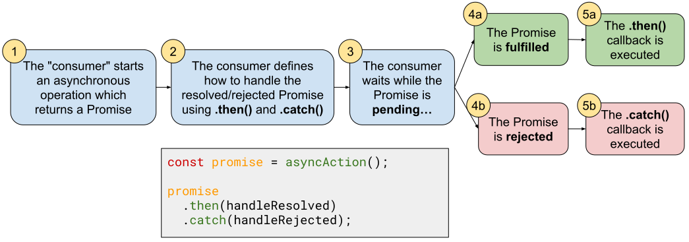
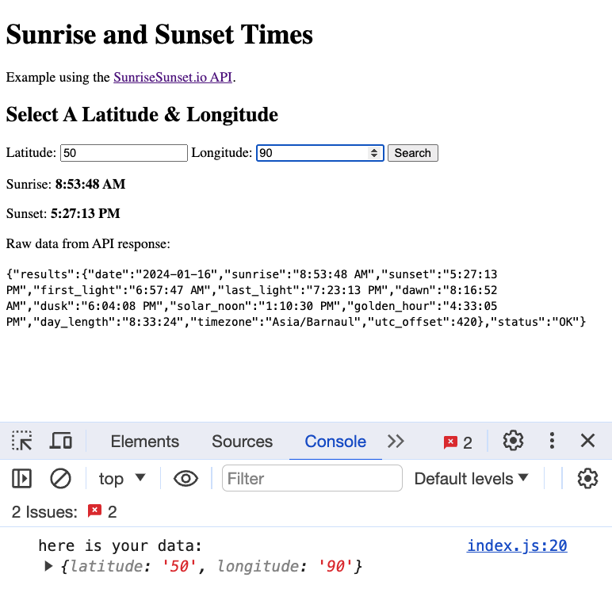

# Unit 3 - Async Code

**Table of Contents:**
- [Promise Overview](#promise-overview)
  - [Promise Syntax: Making a Promise](#promise-syntax-making-a-promise)
  - [Promise Syntax: Using a Promise](#promise-syntax-using-a-promise)
  - [Chaining Promises](#chaining-promises)
- [Fetch](#fetch)
  - [Fetch with `.then()` and `.catch()`](#fetch-with-then-and-catch)
  - [Fetch with `async`/`await` and `try`/`catch`](#fetch-with-asyncawait-and-trycatch)
  - [Benefits of `async` and `await`](#benefits-of-async-and-await)
  - [POST Requests](#post-requests)


## Promise Overview

**Definition:** a promise is an object that represents the eventual completion of an asynchronous operation and the resulting value.

In the Promise's lifetime, it will exist in one of three states:
* **resolved/fulfilled** (the promise's resulting value is ready to be accessed)
* **rejected** (an error occurred in the process)
* **pending** (still working on it...)

**<details><summary style="color:purple">Q: Describe an example of when a Promise would be used. Explain how the Promise will exist in the three states.</summary>**

> Imagine you want to get data about the current weather from a weather API.  When we make that request, we'll be given a promise that will be pending. Eventually, it will "resolve" to the HTTP response with the weather data. If the internet goes down in the middle of your request, the promise will "reject" with a network error. 

</details><br>

### Promise Syntax: Making a Promise

A `Promise` object is created using the `new Promise(resolver)` constructor function. 
* `new Promise(resolver)` takes in a callback that defines how/when the Promise resolves or rejects
* The provided callback is invoked by the Promise with two functions, `resolve` and `reject`. 
* Your callback should invoke `reject(value)` with the value that the Promise should resolve to or `reject(error)` with an error.

Below is an example that will randomly resolve or reject.

```js
const promise = new Promise((resolve, reject) => {
  if (Math.random() > 0.5) {
    resolve('it was above 0.5');
  } else {
    reject(new Error('it was below 0.5'));
  }
});
```

**<details><summary style="color: purple">Q: Who/what invokes the callback given to the `new Promise()` constructor function? Where do the values `resolve` and `reject` come from?</summary>**

> The `new Promise()` constructor function is technically a higher-order function because it accepts a callback function as an argument.
> 
> Just like any other higher-order function, the `new Promise()` constructor will invoke our passed callback for us. When the `new Promise()` constructor invokes our callback, it will provide the `resolve` and `reject` functions as arguments.
> 
> It is up to us to know how to _use_ `resolve` and `reject`, not necessarily how they work under the hood.
> 
> This is similar to other higher-order methods:
> 
> ```js
> const arr = [1,2,3];
> arr.forEach(val => console.log(val));
> 
> document.body.addEventListener('click', (event) => {
>   console.log(e.target);
> })
> ```
> 
> In these examples, the callback given to `forEach` is invoked by `forEach` and the callback given to `addEventListener` is invoked by `addEventListener`. For the event handler callback, we don't know how `addEventListener` creates the `event` object, but that's okay! We just need to know how to use it. 

</details><br>

### Promise Syntax: Using a Promise

Once you have a Promise, you will wait for it to resolve or reject. We don't know when that will happen so we "schedule" callbacks to be executed when the promise settles using `promise.then()` and `promise.catch()`



**<details><summary style="color: purple">Q: When are the callbacks given to `.then()` or `.catch()` executed?</summary>**

> When the promise is fulfilled or rejected (step 5a, or 5b). NOT when it is initially passed to `.then()` or `.catch()` (step 2).

</details><br>

Once we have a `promise` object, we invoke the `.then` and `.catch` methods to schedule callbacks to execute when the promise settles.
* The callback given to `.then` will be invoked with the resolved value
* The callback given to `.catch` will be invoked with the rejected value

```js
// our promise is created
const promise = new Promise((resolve, reject) => {
  if (Math.random() > 0.5) {
    resolve('It was above 0.5');
  } else {
    reject(new Error('It was below 0.5'));
  }
});

// define what to do when it resolves/rejects
promise
  .then((resolvedValue) => {
    console.log(`Success! ${resolvedValue}`);
  })
  .catch((error) => {
    console.log(`Failure. ${error.message}`);
  })

console.log('Hello World');
```

**<details><summary style="color: purple">Q: Consider the code above. What will be printed to the console if the promise resolves? What will be printed if it rejects?</summary>**

> `Success! It was above 0.5` if it resolves.
> `Failure! It was below 0.5` if it rejects.

</details><br>

It is important to remember that when we "schedule" the callbacks with `.then` and `.catch`, we are not executing those callbacks. Those callbacks will be executed asynchronously, meaning they will occur _after_ any synchronous code.

**<details><summary style="color: purple">Q: Consider the code above. When will the `console.log('Hello World')` statement be executed in relation to the `console.log()` statements in the `.then` and `.catch` callbacks?</summary>**

> Before them because it is synchronous code while those callbacks are executed asynchronously. Even if the promise immediately resolves, those callbacks will happen _after_ synchronous code.

</details><br>

### Chaining Promises

Now **this** is where Promises are super useful and solve the callback hell approach. 

`.then()` (and `.catch()`) will always return a Promise. 

**The Promise that `.then()` returns will resolve to the value that its callback returns.**

```jsx
// Promise.resolve("a") is shorthand for: new Promise((resolve) => resolve("a"))

Promise.resolve("a") // The first promise resolves with "a"
  .then((str) => {
    console.log(str) // print "a"
    return "b";      // This `.then()` resolves a new promise with "b"
  })
  .then((str) => { 
    console.log(str) // print "b"
    return "c";      // This `.then()` resolves a new promise with "c"
  })
  .then((str) => {
    console.log(str) // print "c"
  })
  .then(console.log) // print "undefined"
```

**<details><summary style="color: purple">Q: In the example above, why does the final `.then` callback print `undefined`? </summary>**

> Because the second-to-last `.then` callback doesn't return anything!

</details><br>

## Fetch

### Fetch with `.then()` and `.catch()`

* `fetch()` takes a string URL as an argument and returns a promise.
  * The returned promise will resolve to an HTTP `response` object
  * We can use this `response` object to check the status before moving on.
* The `response` object has a `.json()` method (and a `.text()` method) that can parse the response body. It also returns a Promise.
  * The returned promise will resolve to the fetched `jsonData`.
* If an error occurs, an `Error` object is thrown. We typically handle the error by logging the `error.message`

```js
const fetchPromise = fetch('https://pokeapi.co/api/v2/pokemon/pikachu');

fetchPromise
  .then((response) => {
    if (!response.ok) throw new Error(`Bad Fetch responded with ${response.status}`)
    return response.json()
  })
  .then((jsonData) => console.log(jsonData))
  .catch((error) => console.error(error.message));
```

**<details><summary style="color: purple">Q: What does `fetch()` return? How do we get the requested data?</summary>**

> `fetch()` returns a promise that resolves to a `response` object. We can then parse the response object using `response.json()` to get the requested data.

</details><br>

### Fetch with `async`/`await` and `try`/`catch`

An alternate syntax was created to write asynchronous code in a "synchronous-like" manner. This approach utilizes the `async` and `await` keywords.

Think of this as the pattern: 

```js
// Basics 
thePromise.then((myVal) => {})
/* ↓↓↓↓↓↓↓↓↓↓↓↓↓↓↓↓↓↓↓↓↓↓↓↓ */
const myVal = await thePromise

// Full Error Handling
thePromise.then((myVal) => { }).catch((err) => { })
/* ↓↓↓↓↓↓↓↓↓↓↓↓↓↓↓↓↓↓↓↓↓↓↓↓ */
try {
  const myVal = await thePromise
} catch (err) { 

}
```

And here's some real code! 

```js
const getPikachuData = async () => { 
  try {
    const response = await fetch('https://pokeapi.co/api/v2/pokemon/pikachu');
    if (!response.ok) throw new Error(`Bad Fetch responded with ${response.status}`)

    const jsonData = await response.json();
    console.log(jsonData);
  }
  catch (error) {
    console.error(`${error.name}: ${error.message}`);
  }
};

getPikachuData();
```

- The `async` keyword does two things:
    - First, it labels a function as asynchronous. **This is required for any function that makes use of the `await` keyword**
    - Second, it wraps the function’s returned value in a Promise. If we were to store the returned value of `getPikachuData()`, it would be a Promise.
- To handle errors, we wrap the error-prone code in a `try {}` block and follow it with a `catch (error) {}` block. If an error occurs, the `catch` block will handle it and our program will not crash.
- The `await` keyword causes our code to pause and wait for the Promise to resolve. It then unpacks the Promise and returns the resolved value.

### Benefits of `async` and `await`
    
Using the `async`/`await` syntax with `try` and `catch` has a number of benefits. The main ones being **readability** and **debuggability**.
* We can write async code in a syncrhonous-like manner
* We avoid having to write a bunch of callbacks
* We can avoid common mistakes made when using callbacks
* `try/catch` is a more general-purpose way of handling errors that can be used for more than just fetching.

**<details><summary style="purple">Q: For example, what's wrong with this code? Why does it print `undefined`</summary>**

> Forgot to return from the first `.then` when chaining to a second `.then`!

</details><br>


```js
const promise = fetch('https://reqres.in/api/users')

promise
  .then((response) => {
    if (!response.ok) throw Error(response.status);
    response.json();
  })
  .then((data) => {
    console.log(data); // print undefined
  })
  .catch((error) => {
    console.log(`${error.name}: ${error.message}`);
  })
```

### POST Requests

The default behavior of using `fetch` is to make a `GET` request, but we can also make other kinds of requests by adding a second `options` argument to `fetch()`.

Suppose I wanted to send a `POST` request to a server to create a new user:

```js
const newUser = { name: "morpheus", job: "leader" }
const options = {
  method: "POST",
  headers: { "Content-Type": "application/json" },
  body: JSON.stringify(newUser),
}
```

Most of the `options` object is boilerplate (its mostly the same each time): 
* The `method` determines the kind of request (POST, PATCH, DELETE). GET is the default.
* The `headers` declares that we are sending JSON data. Most APIs require you send JSON data.
* The `body` is what we send to the server. Note that it must be `JSON.stringify()`-ed first.

Here is a function that takes in a `newUser` object and posts it to the https://reqres.in/api/users API endpoint:

```jsx
const postUser = async (newUser) => {
  const options = {
    method: "POST",
    body: JSON.stringify(newUser),
    headers: { "Content-Type": "application/json" },
  }

  try {
    // This is a good API to practice GET/POST/PATCH/DELETE requests
    const response = await fetch('https://reqres.in/api/users', options)
    if (!response.ok) throw Error(response.status);
    
    const data = await response.json();
    console.log(data);
  } catch (error) {
    console.log(`${error.name}: ${error.message}`);
  }
}

postUser({ name: "morpheus", job: "leader" });
```


**<details><summary style="color: purple">Q: If I want to send a GET request to an API, do I need to provide an options object to `fetch()`?</summary>**

> No! The default behavior of `fetch()` is to make a GET request.

</details><br>

## Sunrise Sunset Challenge

Use the https://sunrisesunset.io/api/ API to build a sunrise/sunset application like the one shown below. It should:
- Have a form that lets the user input two numbers: a latitude and longitude
- Upon submission it should:
  - Send a `fetch()` request to the API above using the URL `https://api.sunrisesunset.io/json?lat=30&lng=90` (replacing `30` and `90` with the latitude and longitude from the form)
  - When the fetch resolves, it should display the sunrise time, the sunset time, and the entire raw JSON API response.
  - If the fetch rejects, catch the error and log it.
- As a challenge, have the application fetch the sunrise/sunset for NYC upon first page load.

