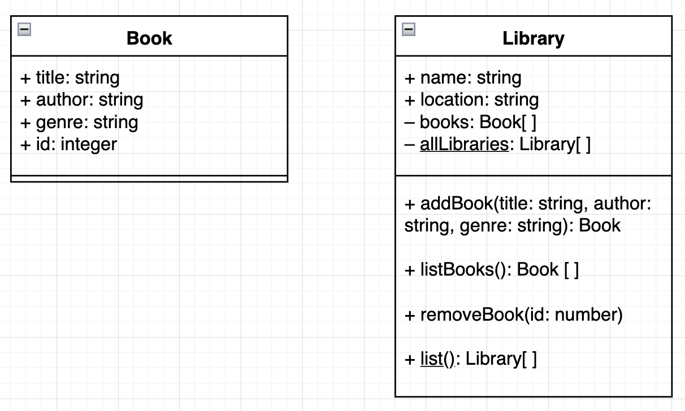
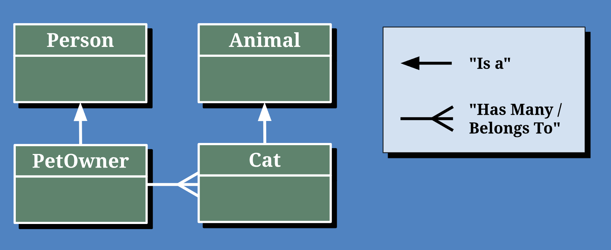

# Has Many / Belongs To

## Class Diagrams

When building an application, the first step is always to make a plan. 
* We plan the features of the application with **user stories**
* We plan the user interface with a wireframe

Now that we're preparing to build more complex applications, we need to start thinking about how we plan our data. This plan is often called the **data architecture** and can be represented with a **Class Diagram**.

UML stands for **U**nified **M**odeling **L**anguage and it defines a way of describing classes and their relationships.


## Practice

UML Diagrams can be created using a tool like https://draw.io or they can simply be drawn using pen and paper.

Take a moment and create a diagram for the `Book` class below:

```js
class Book {
  constructor(title, author, genre) {
    this.title = title;
    this.author = author;
    this.genre = genre;
    this.id = getId();
  }
}
```

Now, to the right of your `Book` diagram, create a diagram for the `Library` class below:

```js
class Library {
  #books = [];

  static #allLibraries = []
  constructor(name, address) {
    this.name = name;
    this.address = address;

    Library.#allLibraries.push(this);
  }
  addBook(title, author, genre) {
    const addedBook = new Book(title, author, genre);
    this.#books.push(addedBook);
    return addedBook;
  }
  listBooks() {
    return [...this.#books];
  }
  removeBook(id) {
    this.#books.splice(this.#books.findIndex((book) => book.id === id), 1);
  }

  static list() {
    return [...Library.#allLibraries];
  }
}
```

**<details><summary style="color: purple">Book and Library Diagrams</summary>**

In this diagram, we take it a step further and define the type of each property, method parameter, and returned value of each method. This is called the **signature** of a property/method.



</details><br>

## Relationships

Class diagrams can show the data and functionality of a class, but the relationships between classes is just as important. 

While there are many types of relationships, and many ways to represent them, below is one way that we can represent two common types of relationships that can exist between classes:
* "Has many / belongs to"
* "Is A"



**<details><summary style="color: purple">Q: What is the relationship between the `Library` and `Book` classes?</summary>**
> A library has many books. A book belongs to a Library
</details><br>

Later this week, we'll learn how to implement an "Is A" relationship with the `extends` keyword.

## Make some has many / belongs to class relationships

Below are some examples of pairs of classes that you can create that will have a "has many / belongs to" relationship. With a partner, first create the class diagram for each class along with the relationship arrow between them. Then, implement the classes in JavaScript.

* `Doctor` and `Appointment`
* `Playlist` and `Song`
* `Group` and `User`
* `Class` and `Student`

Attempt to have a combination of private and public properties / methods, and static and instance properties / methods.

Check out the `library-book-example.js` file for an example.