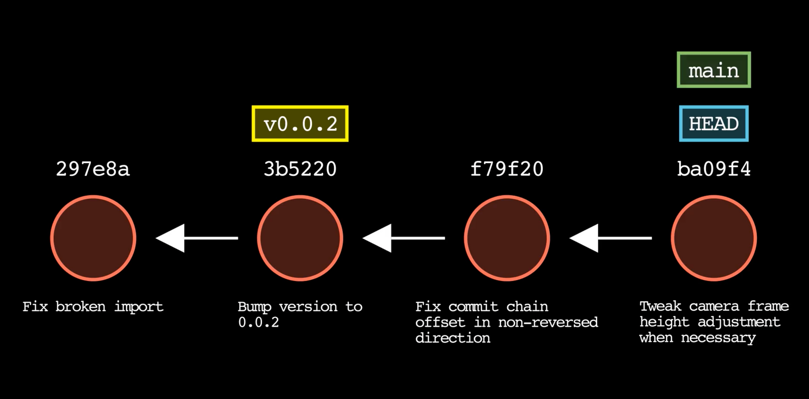

# Git and GitHUb

[Lecture Slides](https://docs.google.com/presentation/d/1ZJZB_i15KlU1h6fO_3Up50PFv_c6juj5oRCCIhChK2o/edit?usp=sharing)

[Lecture recording TBD]()

[Extra video resource](https://youtu.be/SWYqp7iY_Tc?feature=shared)

## You will be able to…

* Learn what a repo is
* Understand Git as a tool for version control
* Develop a sound mental model for the Git/GitHub workflow
* Understand the difference between Git and GitHub
* Create a remote GitHub repository
* Git workflow
  * Stage and commit changes from the command line.
  * Push commits to a remote repository.

## Key Terms /Commands

### Terms
* Version Control System
* Git
* GitHub
* Repository (Repo)
* Remote Repository
* Local Repository
* Stage
* Commit
* Push

### Commands
```
git status
git add ( [ -A ] [ -all ] [ . ])
git commit -m "message"
git push
```

## Why Git? Also what is Git?

**Git** is a tool used for managing the files of repos.

This is what is known as a Version Control System(VCS). Unlike a most tools that save the progress, where the last save overwrite the previous version, a VCS will save a snapshot of where the project is at its current state and can be reverted back to a previous state if needed.

* Each saved version is called a commit. 
* You may decide to commit after completing a single function or an entire feature.
* Commits show the evolution & growth of a project.




## What is a repository?

**Repository** (or repo): a repository is where the history and different versions of a project are stored. Developers use repositories to collaborate on software projects, tracking changes, resolving conflicts, and maintaining different versions of the codebase. 

## Github: What is it & why use it?

**Github** is an online platform for **hosting** Git projects.
* Sharing: Public repositories can be viewed, commented on, and downloaded by other members of the Github community

* Collaborating: Developers can contribute new code to repositories, get feedback on their additions, and eventually merge new changes.