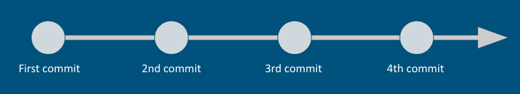
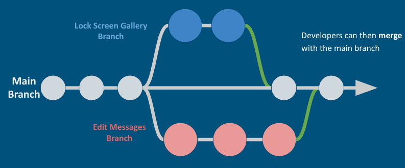
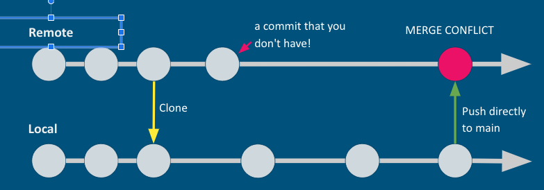

# Collaborative Git

## After this lecture you will be able to: 

* Define the terms "branch" and "merge" as they relate to git
* Create a branch through the Github GUI and the CLI.
* Fork a repository.
* Create a pull request.
* Resolve merge conflicts through the Github GUI and CLI.


## Key Terms/ Commands / Code

### Terms

* `origin`/ `main`
* Branch
* Merge
* Merge Conflict
* Feature
* Pull Request

### Commands

```
git pull
git branch
git branch <new_ branch>
git checkout <branch>
git checkout -b <new_branch>
git push --set-upstream origin <branch>
```

## What is `origin`/`main`?

Whenever you clone a repo, that remote repo is given a nickname called `origin`.
`main` refers to the branch of the remote repository that you are working on.

### Commits in a Linear Fashion

We can think of the history of changes made to a repository like a timeline.

The line represents the `main` branch of a repository. Each circle represents a commit in that branch.



## Branches

Developers will often work in parallel on _new features_ inside a branch — a copy of the main branch.

Instead of a single timeline where one feature is worked on and then the next is worked on, and so on, developers will work in parallel. It's much more efficient for teams to break out and say "team A is working on the lock screen gallery and team B is working on the edit messages feature". These two features are unrelated. So by breaking out, the edit messages team doesn't have to wait for the lock screen team to finish their feature. They can work in parallel.

They do this by creating branches



## Making a new branch

These are the commands for creating a new repository
Git pull first to make sure we have all the updates from the main
Git branch to see which branch we are in and what other branches may exist
Git branch <name> to create a new branch
Git checkout to switch branches
Or, we could have used the shortcut git checkout-b <name>

## Pushing to an "upstream"

We made our branch on our local repo. It doesn't exist in the remote repo.

When we push, git doesn't know where to push to.

The `--set-upstream` flag will create a remote repo branch for us.

## Pull  Request 

Pull requests (PRs) are proposed changes to a repository submitted by a user and accepted or rejected by a repository's collaborators.
"Main, won't you please pull my changes?"


Click on compare & pull request.
* At the top, we can see the base branch (main) and the compare branch (dishes) and that they can be automatically merged! This is because there are no merge conflicts
* We can add comments if we want
* Scroll down to see the commit history
And the files changed
* Scroll up and we can assign reviewers if we'd like or assign someone else to work on the branch from now on.
* We can also tag it with labels or larger projects or milestones that we want to relate this PR to.
Go ahead and create the PR


## Work flow


1. Clone/Pull the project: 
  *  `git clone <ssh>/git pull` 
2. Make the branch/switch into the branch to make changes: 
  * `git branch <new_ branch>` then `git checkout <branch>` or `git checkout -b <new_branch>`
  * `git checkout <branch>`
  *  Make Changes to the files
3. Stage
  * `git add .`
4. Commit
  * `git commit -m "<message>"`
5. Push
  * `git push --set-upstream origin <branch>`
6. Pull request (pr)/ Merge
  * an be done on GitHub
  * Can be done ClI
    ```
    git checkout main
    git merge main/branchName
    ```


## Merge Conflict


### Merge Conflicts (1) - Pushing to main

A merge conflict occurs when a two branches with different histories merge.

